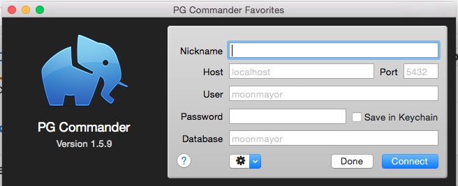

#SQL Books

For each item below figure out the approriate SQL. Create a text file that contains all of your answers and submit it in the Homework repo.

##Getting Started

To get started we'll need to import the booktown.sql file.

1. open terminal
2. use the command `psql -f booktown.sql`
3. type `psql` to open your psql console
4. type \list to ensure the booktown database was successfully completed
5. type `\c booktown` to connect to the booktown database
6. type `\d` to see a list of all the tables in the booktown database
7. type `\d [TABLE_NAME]` to see information about columns and their types for a specific table. You should see output like below:

```
booktown=# \d books
       Table "public.books"
   Column   |  Type   | Modifiers 
------------+---------+-----------
 id         | integer | not null
 title      | text    | not null
 author_id  | integer | 
 subject_id | integer | 
Indexes:
    "books_id_pkey" PRIMARY KEY, btree (id)
    "books_title_idx" btree (title)
```

###Additionally...

Your life will be made easier with a GUI PostgreSQL client. Download [PG Commander](https://eggerapps.at/pgcommander/) if you have a Mac, or [pgAdmin](http://www.pgadmin.org/) if you have Linux.

1. PG Commander asks for a lot of information to begin with. The defaults are fine. Leave everything alone and just press connect.
2. If you don't see the booktown database after connecting you may need to move up a directory. Press the "localhost" under the back and forward buttons.
3. Double click on the `booktown` database to connect.
4. See the list of tables in the database (alternate_stock, authors, book_backup...)
5. Double click a table to see it's contents
6. Double click SQL Terminal to get to a text box where you can write and execute some queries.



# Exercises

Complete the following exercises to practice using SQL.

##Order
1. Find all subjects sorted by subject

	booktown=# SELECT subject FROM subjects ORDER BY subject ASC;

2. Find all subjects sorted by location

	booktown=# SELECT subject FROM subjects ORDER BY location ASC;

##Where
1. Find the book "Little Women"

	booktown=# SELECT location FROM subjects WHERE id = (SELECT subject_id FROM books WHERE title = 'Little Women');

2. Find all books containing the word "Python"

	booktown=# SELECT title FROM books WHERE title LIKE '%Python%';

3. Find all subjects with the location "Main St" sort them by subject

	booktown=# SELECT subject FROM subjects WHERE location = 'Main St';

##Joins

* Find all books about Computers list ONLY book title

	booktown=# SELECT title FROM books WHERE subject_id = (SELECT id FROM subjects WHERE subject = 'Computers');

* Find all books and display ONLY
	* Book title
	* Author's first name
	* Author's last name
	* Book subject

	booktown=# SELECT title, first_name, last_name, subject FROM books b
	JOIN authors a ON b.author_id = a.id JOIN subjects s ON b.subject_id = s.id;

* Find all books that are listed in the stock table
	* Sort them by retail price (most expensive first)
	* Display ONLY: title and price

	booktown=# SELECT title, retail FROM stock s JOIN editions e ON s.isbn = e.isbn JOIN books b ON e.book_id = b.id ORDER BY retail DESC;

* Find the book "Dune" and display ONLY
	* Book title
	* ISBN number
	* Publisher name
	* Retail price

	booktown=# SELECT title, s.isbn, name, retail FROM stock s
	JOIN editions e ON s.isbn = e.isbn JOIN books b ON e.book_id = b.id JOIN publishers p ON e.publisher_id = p.id WHERE title = 'Dune';

* Find all shipments sorted by ship date display ONLY:
	* Customer first name
	* Customer last name
	* ship date
	* book title

	booktown=# SELECT first_name, last_name, ship_date, title FROM shipments s
	JOIN editions e ON s.isbn = e.isbn JOIN customers c ON s.customer_id = c.id JOIN books b ON e.book_id = b.id ORDER BY ship_date;

##Grouping and Counting

1. Get the COUNT of all books

	booktown=# SELECT COUNT(*) FROM books;

* Get the COUNT of all Locations

	booktown=# SELECT COUNT(location) FROM subjects;

* Get the COUNT of each unique location in the subjects table. Display the count and the location name. (hint: requires GROUP BY).
	
	booktown=# SELECT location, COUNT (location) FROM subjects GROUP BY location;

* List all books. Display the book_id, title, and a count of how many editions each book has. (hint: requires GROUP BY and JOIN)

	booktown=# SELECT book_id, title, edition FROM editions e JOIN books b ON e.book_id = b.id GROUP BY book_id, title, edition;


####YAY! You're done!!
