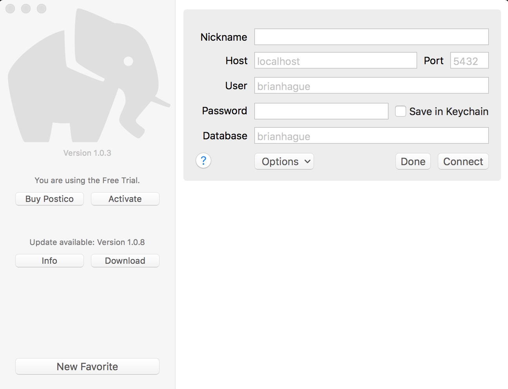
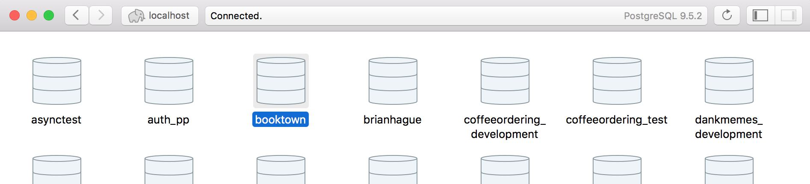

#Booktown, USA

For each question below, find the approriate SQL query to obtain the information requested. Create a `.txt` or `.md` file that contains all of your answers.

##Getting Started

To get started we'll need to import the booktown.sql file.

1. Fork and clone this repository
2. `cd` into the repository
3. use the command `psql -f booktown.sql`
4. type `psql` to open your psql console
5. type \list to ensure the booktown database was successfully completed
6. type `\c booktown` to connect to the booktown database
7. type `\d` to see a list of all the tables in the booktown database
8. type `\d [TABLE_NAME]` to see information about columns and their types for a specific table. You should see output like below:

```
booktown=# \d books
       Table "public.books"
   Column   |  Type   | Modifiers 
------------+---------+-----------
 id         | integer | not null
 title      | text    | not null
 author_id  | integer | 
 subject_id | integer | 
Indexes:
    "books_id_pkey" PRIMARY KEY, btree (id)
    "books_title_idx" btree (title)
```

###Additionally...

Your life will be made easier with a GUI PostgreSQL client. We downloaded these during the installfest. Open up **Postico** if you have a Mac, or **pgAdmin** if you have Linux.

If you're missing the PostgreSQL client, download [Postico here](https://eggerapps.at/postico/) if you have a Mac, or [pgAdmin here](http://www.pgadmin.org/) if you have Linux.

1. Postico asks for a lot of information to begin with. The defaults are fine. Leave everything alone and just press connect.
2. If you don't see the booktown database after connecting you may need to move up a directory. Press the "localhost" under the back and forward buttons.
3. Double click on the `booktown` database to connect.
4. See the list of tables in the database (alternate_stock, authors, book_backup...)
5. Double click a table to see it's contents
6. Double click SQL Terminal to get to a text box where you can write and execute some queries.




## Queries

Complete the following exercises to practice using SQL.

###Order
1. Find all subjects sorted by subject

  > SELECT subject FROM subjects ORDER BY subjects ASC;
2. Find all subjects sorted by location

  > SELECT subject FROM subjects ORDER BY location ASC;

###Where
1. Find the book "Little Women"

  > SELECT * FROM books WHERE title = 'Little Women';
2. Find all books containing the word "Python"

  > SELECT * FROM books WHERE title ILIKE '%python%';
3. Find all subjects with the location "Main St" sort them by subject

  > SELECT * FROM subjects WHERE location = 'Main St' ORDER BY subject ASC;


###Joins

* Find all books about Computers list ONLY book title
  > SELECT title FROM books
  > INNER JOIN subjects
  > ON books.subject_id = subjects.id
  > WHERE subject = 'Computers';

* Find all books and display ONLY
	* Book title
	* Author's first name
	* Author's last name
	* Book subject
    > SELECT books.title, authors.first_name, authors.last_name, subjects.subject 
    > FROM books
    > INNER JOIN authors
    > ON books.author_id = authors.id
    > INNER JOIN subjects
    > ON books.subject_id = subjects.id;
* Find all books that are listed in the stock table
	* Sort them by retail price (most expensive first)
	* Display ONLY: title and price

    > SELECT books.title, stock.retail FROM stock
    > INNER JOIN editions
    > ON stock.isbn = editions.isbn
    > INNER JOIN books
    > ON editions.book_id = books.id
    > ORDER BY stock.retail DESC;

* Find the book "Dune" and display ONLY
	* Book title
	* ISBN number
	* Publisher name
	* Retail price

    > SELECT books.title, editions.isbn, publishers.name, stock.retail FROM books
    > INNER JOIN editions
    > ON books.id = editions.book_id
    > INNER JOIN publishers
    > ON editions.publisher_id = publishers.id
    > INNER JOIN stock
    > ON stock.isbn = editions.isbn
    > WHERE books.title = 'Dune';

* Find all shipments sorted by ship date display ONLY:
	* Customer first name
	* Customer last name
	* ship date
	* book title

    > SELECT books.title, customers.first_name, customers.last_name, 
    > shipments.ship_date FROM shipments
    > LEFT JOIN customers
    > ON shipments.customer_id = customers.id
    > LEFT JOIN editions
    > ON editions.isbn = shipments.isbn
    > LEFT JOIN books
    > ON editions.book_id = books.id
    > ORDER BY shipments.ship_date ASC;

###Grouping and Counting

1. Get the COUNT of all books
  > SELECT COUNT(title) FROM books;
* Get the COUNT of all Locations
  > SELECT COUNT(DISTINCT location) FROM subjects
* Get the COUNT of each unique location in the subjects table. Display the count and the location name. (hint: requires GROUP BY).
  > SELECT location, COUNT(location) FROM subjects
  > GROUP BY location;

* List all books. Display the book_id, title, and a count of how many editions each book has. (hint: requires GROUP BY and JOIN)
  > SELECT books.id, books.title, COUNT(editions.edition) FROM books
  > LEFT JOIN editions
  > ON editions.book_id = books.id
  > GROUP BY books.id;

####YAY! You're done!!
